# WTK_KSP_Multiplayer

🚀 **Kerbal Space Program + LunaMultiplayer Setup Guide**

Complete setup instructions for Kerbal Space Program with LunaMultiplayer (LMP) and mods using CKAN.

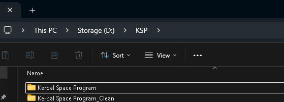

## 📋 Prerequisites

- Windows PC with Steam
- .NET Framework 4.8 or higher
- ~20GB free disk space (for clean + modded copies)
- Stable internet connection

## 🧹 Step 1: Clean KSP Installation

### Uninstall from Steam

1. Open Steam → Library
2. Right-click **Kerbal Space Program** → **Manage** → **Uninstall**

### Remove Leftover Files

Navigate to and delete any remaining files:

```
C:\Program Files (x86)\Steam\steamapps\common\Kerbal Space Program\
```

### Reinstall KSP

1. Reinstall KSP through Steam
2. Ensure **beta version is disabled**:
   - Right-click KSP → **Properties** → **Betas** tab → Set to **None**

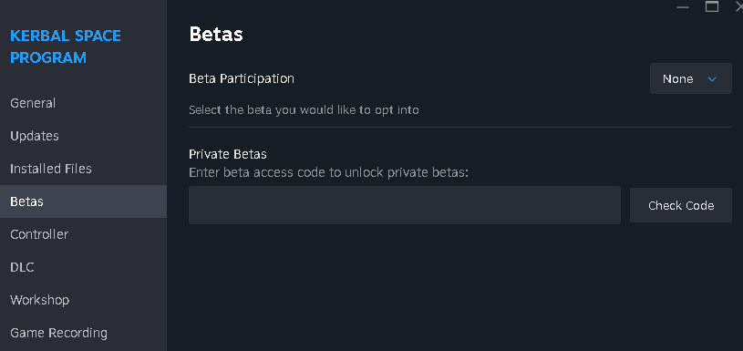

## 📁 Step 2: Create Game Copies

1. Navigate to your KSP installation:

   ```
   C:\Program Files (x86)\Steam\steamapps\common\Kerbal Space Program\
   ```

2. Copy the entire folder to:

   ```
   D:\Games\Kerbal Space Program_clean\
   ```

3. Copy again and rename to:
   ```
   D:\Games\Kerbal Space Program_Modded\
   ```

> 💡 **Important**: Keep the `_clean` copy untouched as a backup. Use only the `_Modded` copy for multiplayer.

## 🔧 Step 3: Verify .NET Framework

1. Press `Win + R`, type `cmd`, press Enter
2. Run: `dotnet --version`
3. If version is below 4.8, download from: https://dotnet.microsoft.com/download

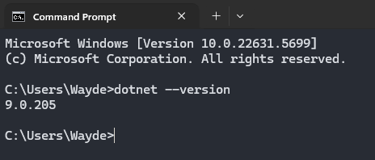

## 🧩 Step 4: Setup CKAN Mod Manager

### Download and Install

1. Download `CKAN.exe` from: https://github.com/KSP-CKAN/CKAN/releases
2. **Move** `CKAN.exe` into your `Kerbal Space Program_Modded` folder
3. Run `CKAN.exe` from that location

### Initial Configuration

1. Select **KSP 1.12** ONLY (uncheck other versions)

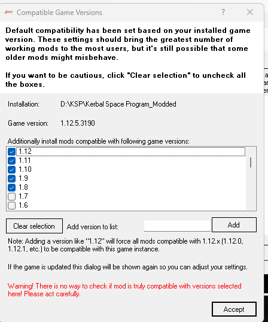

Select only KSP 1.12 and click Continue:

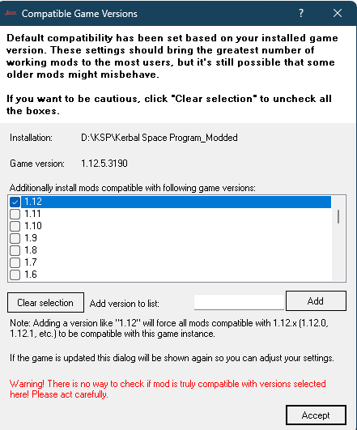

2. Click **Yes** to check for updates
3. Refresh mod list if prompted

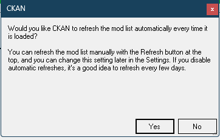

4. You may see a permission dialog - click **Yes**:

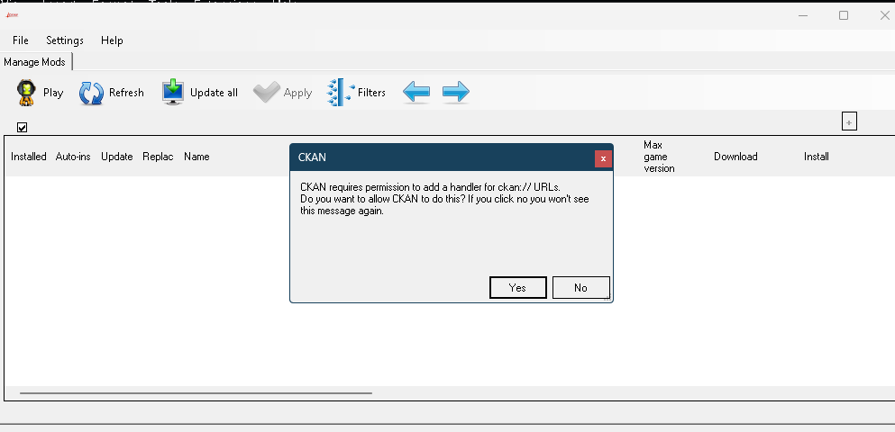

### Cleanup Game Instances

- Go to **Settings** → **Manage Game Instances**

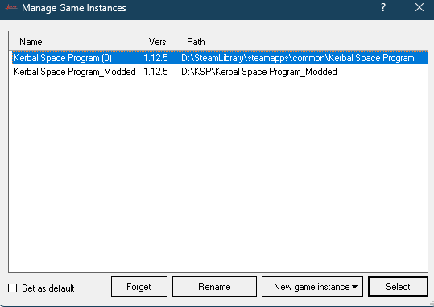

- Remove all instances except `Kerbal Space Program_Modded`

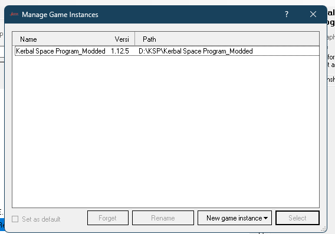

## 📦 Step 5: Install Mod Pack

1. Download the mod list: `WTKKSPMultiplayerV1.ckan` from:
   https://github.com/WaydeTheKiwi/WTK_KSP_Multiplayer

2. In CKAN: **File** → **Install from .ckan**

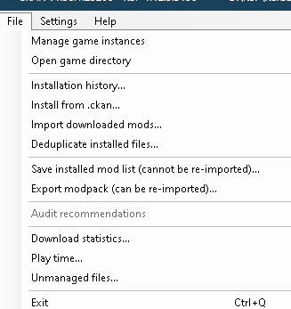

3. Press **Apply**

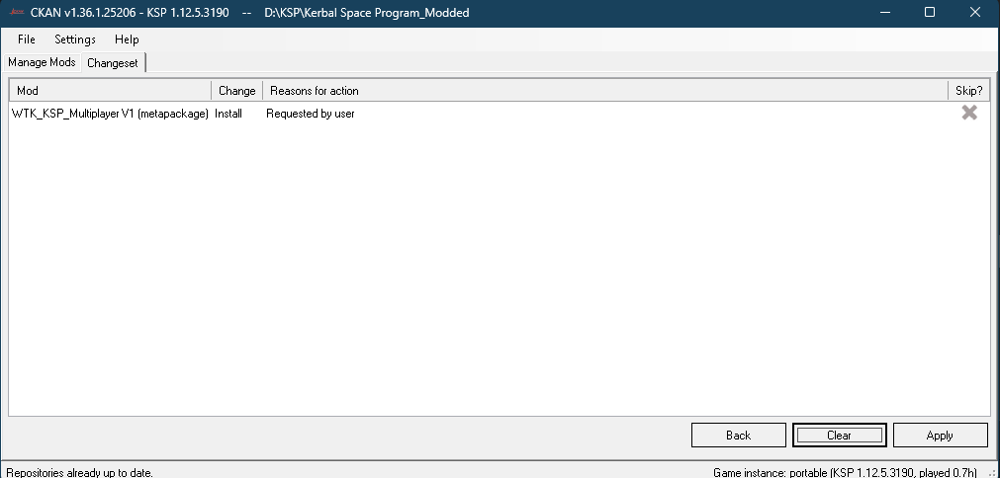

4. Confirm installation when prompted to overwrite:

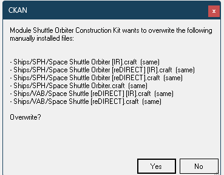

## 🚀 Step 6: First Launch

### Launch KSP

- Click **Launch KSP** in CKAN, or run `KSP_x64.exe` from the modded folder

### What to Expect

- First launch takes several minutes
- "Loading Expansions" and ModuleManager setup will be slow
- If Parallax warning appears and won't close, press `ESC`

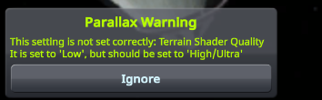

- You may also see Community Fixes notifications - these are normal:

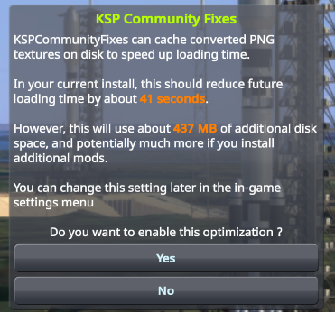

## ⚙️ Step 7: Configure Settings

### General Settings

- ✅ Enable **Advanced Tweakables**

### Input Settings

- **Default Throttle (Pre-Launch)**: 100%

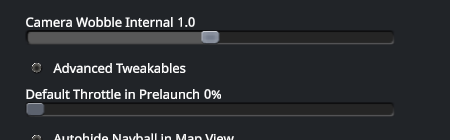

### Graphics Settings

- **Terrain Detail**: High or Ultra
- **Texture Quality**: High or Full Res
- ✅ Enable **Terrain Scatters**
- **Terrain Scatters Quality**: High or higher
- **Terrain Shader Quality**: High or higher

### Optional: Borderless Window

1. Turn **OFF** Fullscreen in KSP settings
2. In CKAN, hover over **Launch** button → **Edit Launch Command**

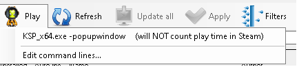

3. Set to: `KSP_x64.exe -popupwindow`

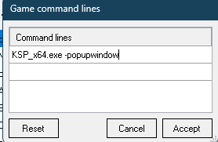

### Test Your Installation

- Create a new sandbox save
- Verify planets, mods, and UI are working correctly

## 🌐 Step 8: Connect to Multiplayer

1. From main menu, click **Luna Multiplayer**
2. Click the **+** button to add server
3. Enter server details:
   - **Address**: `ksp.waydethekiwi.com`
4. Enter your **Player Name**
5. Click the **Satellite icon** to connect

## 🎯 Success!

You're now ready to explore the Kerbal universe with friends! 🚀

## 💡 Helpful Tips for First Time Players

### Initial Mod Setup

- **Click Through Blocker**: When prompted, select "Focus-Follows-Mouse" if unsure, then click accept
- **Toolbar Controller**: Read the information and click "hide this window at startup" when finished
- **Lunar Transfer Planner**: Close this window by clicking the crescent moon toolbar icon (not needed for basic gameplay)
- **Principia**: Feel free to close this window for now
- **kOS Connectivity**: If using kOS, set to "CommNetConnectivityManager" when prompted (for Real Antennas compatibility)

### Visibility at Night

The game uses UTC time, so it may be dark when you start. To improve visibility:

1. Press `ESC` → **Settings**
2. Find "Ambient Light Boost" setting
3. Set to around 10-15% for better night visibility while maintaining realism

### Launch Site Selection


Your starting launch site is Kennedy Space Center (KSC), which provides a good balance of difficulty and accessibility. To change launch sites:

1. Go to **Tracking Station**
2. Use the "eye" button to show/hide launch sites
3. Click sites directly or use the list view
4. **Kourou**: Easier launches, good for beginners
5. **Baikonur**: More challenging, higher delta-V requirements

### Understanding Resources

Monitor your resources at the top of the screen:

- **Funds**: Money for operations and construction
- **Reputation**: Affects funding and contract availability
- **Science**: Used to unlock new technology
- **Confidence**: Spent on accelerated programs and bonuses

### Contract Strategy

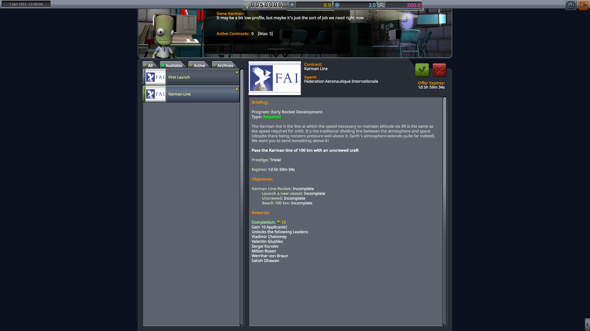

Visit Mission Control regularly to:

- Accept available contracts for reputation and rewards
- Focus on contracts that match your current capabilities
- Remember: cancelled contracts have no penalties in this modpack

### Building Strategy

Start simple and work your way up:

- Begin with suborbital flights before attempting orbit
- Sounding rockets are perfect for early altitude and speed contracts
- Test components thoroughly in atmosphere before space missions
- Use the 100km Karman Line as your first major milestone

### Additional Resources

For detailed gameplay mechanics, advanced strategies, and comprehensive tutorials, refer to:
**https://github.com/KSP-RO/RP-1/wiki/Early-Career-Tutorial**

This guide covers advanced topics including:

- Detailed career progression strategies
- Complex mission planning techniques
- Advanced mod interactions and configurations
- In-depth explanations of realistic space program mechanics

## 📝 Notes

- Keep your `_clean` copy for vanilla KSP or troubleshooting
- CKAN will manage mod updates automatically
- Server may have specific rules - check with administrators
- Save frequently and use multiple save slots for important missions

---

**Happy flying, astronauts!** 🌌
